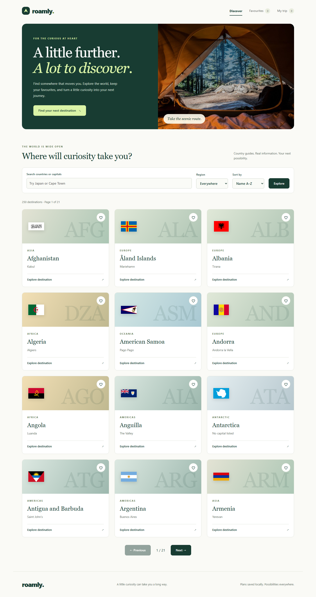

# Roamly

## Overview

Roamly is a travel discovery and local trip-planning application built with React, Vite, and strict TypeScript. It evolves this repository's original static camping landing page into an interactive product while retaining its green visual direction and camping photograph.

The migration from Next.js is deliberate: the application relies on public browser-accessible data and local plans, so a client-side React architecture avoids a runtime server and keeps state ownership within React. This trades away server rendering and route-specific SEO. See [engineering decisions](docs/engineering-decisions.md) for the reasoning and reconsideration criteria.

## Features

- Discover six curated travel places in a swipeable, keyboard-accessible carousel with locally hosted photography, small flag metadata, and an expandable country catalogue.
- Explore country guides backed by real public metadata, including flags, capitals, languages, currencies, population, time zones, and coordinates.
- Search places, countries and capitals, filter regions, and sort/paginate country guides. Submitted filters live in the URL and work with bookmarks and browser history.
- Save favourites and return to a personal shortlist.
- View modelled current weather with Celsius temperatures and km/h wind, independent loading, retry, and unavailable states.
- Build an itinerary, edit dates and notes, reorder with keyboard-accessible buttons, remove stops, and view planned nights and calendar span.
- Persist trips and favourites locally with versioned validation and visible recovery when browser storage fails.
- Responsive layouts, loading skeletons, empty states, route errors, accessible labels, focus styles, and reduced motion.

## Screenshots

Captured from the production preview with live country and weather APIs on 6 October 2026. The trip uses an illustrative, locally entered plan; it is not a booking.



[Place guide](docs/screenshots/place-desktop.png) · [Country guide](docs/screenshots/destination-desktop.png) · [Trip planner](docs/screenshots/trip-desktop.png) · [Mobile discovery](docs/screenshots/discovery-mobile.png)

## Architecture

```text
src/
  main.tsx                     React bootstrap
  app/                         Router, provider composition, layout, global styles
  domain/                      Framework-independent country, destination and trip types
  features/
    countries/                 Country API adapter and pure URL filtering
    destinations/              Curated catalogue, discovery, cards and guide routes
    weather/                   Weather API adapter and recoverable panel
    favourites/                Shortlist route, focused Context and repository
    trip/                      Planner route, focused Context, repository and calculations
  shared/
    http.ts                    Fetch timeout, cancellation and unknown-data helpers
    date.ts                    Calendar date validation
    persistence/               Generic versioned repository and React integration
    ui/                        Shared loading, empty and error feedback
```

React Router owns `/`, `/places/:destinationSlug`, `/destinations/:countryCode`, `/favourites`, `/trip`, and the unmatched-route fallback. Route modules load on demand. Route errors have reload and home actions; navigation updates the document title and moves focus to the main landmark. No Next.js imports, Server Components, server routes, or framework hydration remain. All components run in the browser.

See [architecture](docs/architecture.md) for dependency boundaries and placement rules.

### State ownership

| Kind                           | Owner                              | Reason                                                                   |
| ------------------------------ | ---------------------------------- | ------------------------------------------------------------------------ |
| Country and weather data       | TanStack Query                     | Request deduplication, cancellation, freshness, retry and cached results |
| Search, region, sort, page     | React Router search parameters     | Bookmarking and browser history without duplicated filter state          |
| Trip and favourite data        | Separate focused Context providers | Shared by navigation, cards, details, and dedicated pages                |
| Draft dates, notes, feedback   | Component React state              | Unsaved edits belong to a single stop editor                             |
| Night counts, filtered results | Pure derived values                | Computed from source data rather than synchronised with effects          |
| Persistence                    | Small repository interface         | Browser storage is isolated from presentation and can be replaced        |

There is no Redux. Two small shared collections do not justify a store, middleware, or action framework. The form search is applied on Enter or Explore; it does not request data per keystroke, so a debounce would add latency without reducing network work.

### Data access and caching

Country and weather adapters receive `unknown`, validate essential fields, and map external shapes to domain types. Invalid optional metadata degrades to missing values; unusable country records are discarded, and an entirely unusable payload is an error. Weather unit mismatches or malformed essential fields are rejected. API calls have a 15-second timeout, cancellation, HTTP error mapping, and one retry.

The single country query is fresh for 24 hours and retained for 24 hours when inactive. Discovery and detail pages share it, so opening a guide usually needs no second country request. The bounded reference dataset contains around 250 countries/territories; only 12 compact country rows render per page, in an expandable catalogue. A separate editorial collection of six places leads discovery; it is not inferred from country data. Weather is keyed by coordinates, fresh for 10 minutes, and retained for 30 minutes when inactive. Stale active queries can refetch on focus/reconnect. Query caching is in memory, not persistent/offline storage; HTTP caching still follows upstream headers.

Country errors show a retry action. A background failure can show cached data. Weather has a separate error state so the guide stays usable. Weather is fetched after country coordinates are known; that dependency is necessary, and no weather requests run for listing cards.

### Persistence

`createRepository` depends on a minimal `getItem`/`setItem` port. Browser access happens through two repositories with `{ version: 1, data }` envelopes. Lazy state initialisation reads stored data before the first application render. Reads are side-effect free and safe under StrictMode; no initial effect overwrites corrupt data. Saves happen on user actions. Quota, access, malformed JSON, and unknown schema versions return warnings and preserve usable session state.

Storage events refresh saved collections across tabs. Concurrent writes use last-writer-wins, and an open editor keeps its unsaved draft until saved or remounted. Persistence is browser-local and unencrypted; clearing site data removes it. Duplicate countries are prevented within a trip. Editing dates does not reorder stops automatically.

## APIs

### Country metadata

The [public REST Countries Conventus mirror](https://restcountries.conventus.de/) serves the v3.1 schema at `https://restcountries.conventus.de/v3.1/all`. The request selects the documented maximum of ten fields. Live GET and browser CORS were verified during implementation.

The [current REST Countries service](https://restcountries.com/docs/countries/api-versions) deprecates the old APIs and requires authentication for v5. Roamly does not expose an account key or rely on its restricted demo token. The mirror is an explicit availability trade-off, without a promised SLA or a published numeric quota. The app fetches once per dataset freshness window, not per search. A future commercial product should use a maintained provider behind a secret-bearing server boundary or a licensed, periodically rebuilt dataset.

Flag images come from HTTPS URLs in country metadata (currently FlagCDN). Metadata and flags are starting points for discovery, not official travel advice.

### Weather

[Open-Meteo forecast documentation](https://open-meteo.com/en/docs) defines the keyless `/v1/forecast` endpoint and current `temperature_2m`, `wind_speed_10m`, and `weather_code` variables. Roamly requests explicit units and GMT timestamps at the country coordinates. Country guides use country coordinates; curated place guides use approximate place coordinates. These are model estimates, not observations or exact-address forecasts.

The [free API terms](https://open-meteo.com/en/pricing) apply to noncommercial use, with limits of 10,000 daily calls, 5,000 hourly calls, 600 calls per minute, and 300,000 monthly calls, without an uptime guarantee. Attribution links appear in the UI. Commercial use needs the appropriate licence and a different deployment boundary for any private key. No API keys or environment variables are needed for this application.

### Destination photography

Six curated Pexels photographs are downloaded and served locally in 480/960 px variants, with responsive image selection, credits, and an intentional illustration if a photo fails. No photography API, key, backend, or runtime photo CDN dependency is required. See [photography sources and rights](docs/photography.md). Place and country models are separate; existing favourites and trips continue to save countries.

## Tech stack

- **React:** component composition, controlled inputs, predictable state ownership, and focused shared providers.
- **Vite:** fast local development and static production output without a runtime server.
- **TypeScript:** strict checking and explicit domain types; runtime validation at untrusted boundaries.
- **React Router:** lazy client routes, URL state, navigation semantics, and error boundaries.
- **TanStack Query:** cache lifecycle and remote-state recovery without recreating them with effects.
- **CSS:** a small visual system without the original utility/framework dependencies or a component library.
- **Vitest / Testing Library:** boundary, calculation, storage, and user interaction tests.
- **Playwright / axe:** production-build journeys and automated accessibility checks at desktop/mobile sizes.

## Getting started

Use a current patch of **Node.js 22 LTS (22.13.0 minimum)** or **Node.js 24+**, and npm. `.nvmrc` selects the Node 22 line; CI runs on Node 22 and 24. From a fresh clone:

```sh
npm ci
npm run dev
```

The locked tools technically run on Node 20.19+, but Node 20 is end-of-life and is not a supported project baseline. Vite and its React plugin require 20.19+/22.12+; ESLint 10 raises the Node 22 floor to 22.13.0. Vitest, jsdom, Playwright, and React Router are compatible with this choice. See [Vite requirements](https://vite.dev/guide/), [ESLint requirements](https://eslint.org/docs/latest/use/migrate-to-10.0.0), and [Node release support](https://github.com/nodejs/Release).

Open the URL printed by Vite. Public API calls require internet access. On Windows PowerShell with restricted script execution, use `npm.cmd` and `npx.cmd` instead of changing execution policy.

For a production preview:

```sh
npm run build
npm run preview
```

### Static hosting

Upload `dist/` after building. Configure the host to serve `index.html` for client routes, including `/destinations/JPN`, `/trip`, and `/favourites`; otherwise bookmarked deep links return a host 404. Vite preview provides this fallback locally. Assets use root-relative paths, so the current build targets a domain root. Subdirectory deployment requires coordinated Vite `base`, router basename, and asset-path changes. Never embed private keys in `VITE_*` variables, since those are public browser code.

## Scripts

| Command                                   | Purpose                                                       |
| ----------------------------------------- | ------------------------------------------------------------- |
| `npm run dev`                             | Vite development server                                       |
| `npm run build`                           | Strict typecheck and production bundle                        |
| `npm run preview`                         | Serve the existing production build locally                   |
| `npm run lint`                            | ESLint with React Hooks rules and zero warnings               |
| `npm run typecheck`                       | Strict TypeScript checks without emitting files               |
| `npm test` / `npm run test:watch`         | Unit/interaction tests once / in watch mode                   |
| `npm run test:e2e`                        | Desktop/mobile browser suite against the built app            |
| `npm run format` / `npm run format:check` | Apply / verify formatting                                     |
| `npm run validate`                        | Formatting, lint, typecheck, unit tests, build, browser tests |
| `npm audit`                               | Dependency vulnerability audit                                |

## Testing

Install Chromium once before the full suite:

```sh
npx playwright install chromium
npm run validate
npm audit
```

On Linux CI, install Chromium system dependencies with `npx playwright install --with-deps chromium`. The GitHub Actions workflow runs the complete suite and a high-severity audit.

Unit/interaction tests exercise real mappings, invalid data, API errors, URL filtering, pagination bounds, favourite toggling, corrupt/inaccessible storage, trip dates, and immutability. Browser tests intercept upstream APIs with explicitly labelled fixtures for deterministic discovery, retries, weather isolation, favourite persistence, trip editing/reordering/removal, reloads, bookmarks, history, unavailable storage, unknown routes, and axe WCAG checks. Tests do not depend on live weather or create fake data in the application. A separate live-browser smoke check verified the real APIs and generated screenshots.

## Accessibility

Semantic landmarks, navigation links, ordered itinerary lists, definition lists for metadata, labelled native search/date/select/textarea controls, buttons for actions, explicit favourite pressed state, live status text, keyboard reorder actions, visible focus, a skip link, and route focus management are built in. Decorative flag thumbnails have empty alt text; the detail flag has a country-specific description. Motion respects `prefers-reduced-motion`.

Automated WCAG A/AA checks pass for discovery and trip planning in desktop and mobile Chromium. These checks complement the keyboard interaction tests; they do not replace a screen-reader or manual accessibility audit.

## Engineering decisions

The [decision log](docs/engineering-decisions.md) covers Next.js-to-Vite migration, state ownership, public data boundaries, caching, browser persistence, testing, and performance trade-offs. It records context, alternatives, costs, and when each choice should change.

## Known limitations

- Client-side rendering has limited route-specific SEO/social previews and requires JavaScript. No SSR, PWA/offline guarantees, authentication, booking, or cross-device sync.
- Country API availability and data freshness depend on a public mirror. Browser caching cannot repair an upstream outage after a fresh load.
- Country guides use country coordinates; place guides use curated approximate coordinates. City geocoding and forecast ranges are future extensions.
- One itinerary, one stop per country, last-writer-wins browser storage; no conflict resolution or export/import. Unsaved editor drafts are discarded when leaving the route.
- Dates may overlap and leave gaps. The summary explains the distinction between summed nights and overall calendar span; it does not validate travel feasibility.
- Browser automation covers Chromium desktop/mobile viewports, not real devices, WebKit, or Firefox.
- The original camping photograph (`public/camp-lake.jpg`) has no recorded source/licence. Confirm redistribution rights before public publication or replace it with a documented asset. Curated destination photo sources are documented separately.
